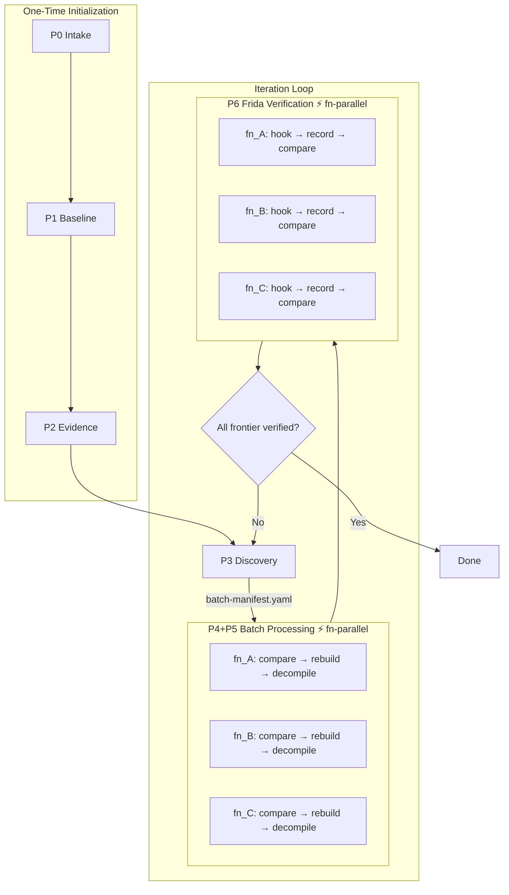

# Headless Ghidra — Global Orchestrator

This skill is the global orchestrator for the end-to-end decompilation pipeline.
It performs **zero** analysis work itself — its sole responsibility is reading
state, dispatching sub-agents, running gate checks, and managing user dialogs.

## Role Definition

| Property | Value |
|---|---|
| **Agent ID** | `orchestrator` |
| **Instances** | 1 (globally unique) |
| **Lifecycle** | Long-lived — from project start until all functions are verified |

## Sub-Skill Family

```
headless-ghidra                       ← this skill (orchestrator)
├── headless-ghidra-intake            ← P0 target intake
├── headless-ghidra-baseline          ← P1 baseline extraction
├── headless-ghidra-evidence          ← P2 evidence review
├── headless-ghidra-discovery         ← P3 batch discovery
├── headless-ghidra-batch-decompile   ← P4+P5 batch decompilation
└── headless-ghidra-frida-verify      ← P6 Frida I/O verification
```

| # | Skill | Phase | Responsibility |
|---|---|---|---|
| 1 | [`headless-ghidra-intake`](../headless-ghidra-intake/SKILL.md) | P0 | Target identity, workspace creation, Ghidra discovery, archive normalization |
| 2 | [`headless-ghidra-baseline`](../headless-ghidra-baseline/SKILL.md) | P1 | Ghidra headless auto-analysis, baseline evidence export (6 YAML files) |
| 3 | [`headless-ghidra-evidence`](../headless-ghidra-evidence/SKILL.md) | P2 | Four-dimension evidence review (parallel), third-party library identification, anchor synthesis, optional Frida |
| 4 | [`headless-ghidra-discovery`](../headless-ghidra-discovery/SKILL.md) | P3 | Analyze verified boundaries + baseline evidence → output next frontier batch |
| 5 | [`headless-ghidra-batch-decompile`](../headless-ghidra-batch-decompile/SKILL.md) | P4+P5 | Function-level parallel: source comparison → semantic reconstruction → decompilation (Ghidra operations queued) |
| 6 | [`headless-ghidra-frida-verify`](../headless-ghidra-frida-verify/SKILL.md) | P6 | Function-level parallel Frida I/O verification, results serve as gate |

## Pipeline Overview



## State Management

The orchestrator manages global state through `pipeline-state.yaml`, which is
the single authoritative source of truth.

**Path**: `.work/ghidra-artifacts/<target-id>/pipeline-state.yaml`

The orchestrator updates this file at each phase transition, recording:
- Global progress (`overall_status`, `current_iteration`)
- Phase-level gate status (`phases.P0..P2`)
- Iteration-level details (`iterations.<NNN>.functions.<fn_id>`)
- Verified boundary list (`verified_boundaries`)
- Ghidra operation queue state (`ghidra_queue`)

## Gate Checks

The orchestrator calls `gate-check.sh` at each phase transition:

```bash
# Phase-level gates
scripts/gate-check.sh --gate P0 --artifact-root <path>
scripts/gate-check.sh --gate P1 --artifact-root <path>
scripts/gate-check.sh --gate P2 --artifact-root <path>
scripts/gate-check.sh --gate P3 --artifact-root <path> --iteration 001

# Function-level gates
scripts/gate-check.sh --gate P5 --artifact-root <path> --iteration 001 --function fn_001
scripts/gate-check.sh --gate P6 --artifact-root <path> --iteration 001 --function fn_001
```

Return codes: `0` = pass, `1` = fail (blocking), `2` = warn (conditional)

## User Interaction

The orchestrator uses dialogs for user interaction in these scenarios:

| Scenario | Dialog Type |
|---|---|
| In-progress project found | Resume / Restart choice |
| After P2 completion | Frida supplement needed? Yes/No |
| After P3 discovery | Show batch list + Confirm/Modify |
| P6 function diverged | Show divergence + Retry/Skip/Stop |
| All iterations complete | Show summary + Confirm completion |

## Available Tools

- `scripts/gate-check.sh` — gate validation
- `scripts/ghidra-queue.sh` — Ghidra lock management
- `yq` — YAML read/write
- Sub-agent dispatch capability
- User dialog capability

## Scripting Guidelines (If custom analysis is needed)

- ⛔ **Python / Jython scripts are strictly forbidden**. Ghidra Headless is not configured with the Jython extension, so `.py` scripts will always crash with `GhidraScriptLoadException`.
- ✅ **Write custom Java scripts**. If you need to write a custom Ghidra script to accomplish a task, write it in Java extending `GhidraScript`.
- ⚠️ **Compilation Rule**: The file name MUST exactly match the public class name (e.g., `YourScript.java` MUST contain `public class YourScript extends GhidraScript`). Failure to do so causes `ClassNotFoundException`.

## Strict Prohibitions

- ⛔ **Must not execute any Frida commands**
- ⛔ **Must not write reconstruction code**
- ⛔ **Must not modify any artifacts under `baseline/`, `evidence/`, `iterations/` directly via shell (use YAML tools or state updates)**

## Orchestration Pseudocode

```python
def orchestrate(target_path):
    state = load_pipeline_state(target_path)

    if state and state.overall_status == "in_progress":
        choice = popup("resume", summary_of(state))
        if choice == "restart": state = None
    if not state:
        state = create_pipeline_state(target_path)

    # ─── P0 ───
    if not gate_passed(state, "P0"):
        await parallel(
            spawn_agent("intake-workspace", skill="headless-ghidra-intake",
                        role="P0 workspace initialization",
                        inputs={"target_path": target_path}),
            spawn_agent("intake-ghidra", skill="headless-ghidra-intake",
                        role="P0 Ghidra discovery",
                        inputs={}),
        )
        run_gate("P0", state)

    # ─── P1 ───
    if not gate_passed(state, "P1"):
        await spawn_agent("baseline-export", skill="headless-ghidra-baseline",
                          role="P1 baseline export",
                          inputs={"target_identity": read("intake/target-identity.yaml"),
                                  "ghidra": read("intake/ghidra-discovery.yaml")})
        run_gate("P1", state)

    # ─── P2 ───
    if not gate_passed(state, "P2"):
        await parallel(
            spawn_agent("evidence-review-imports", ...),
            spawn_agent("evidence-review-strings", ...),
            spawn_agent("evidence-review-types", ...),
            spawn_agent("evidence-review-libraries", ...),
        )
        await spawn_agent("evidence-synthesize", ...)
        if popup("need_frida?") == "yes":
            await spawn_agent("evidence-frida", ...)
        run_gate("P2", state)

    # ─── Iteration Loop ───
    while True:
        iteration = next_iteration(state)

        # P3
        batch = await spawn_agent("discovery", ...)
        confirmed = popup("confirm_batch", batch)
        run_gate("P3", state, iteration)

        # P4+P5
        decompile_agents = [
            spawn_agent(f"decompile-{fn.id}", ...)
            for fn in confirmed.functions
        ]
        await parallel(*decompile_agents)
        for fn in confirmed.functions:
            run_gate("P5", state, iteration, fn.id)

        # P6
        verify_agents = [
            spawn_agent(f"verify-{fn.id}", ...)
            for fn in confirmed.functions
        ]
        await parallel(*verify_agents)
        for fn in confirmed.functions:
            gate = run_gate("P6", state, iteration, fn.id)
            if gate.passed: mark_verified(state, fn)
            else: add_retry(state, fn)

        if all_goals_verified(state):
            popup("completed", state)
            break
```

## Artifact Path Conventions

All artifacts are relative to `.work/ghidra-artifacts/<target-id>/`:

| Phase | Path Prefix |
|---|---|
| P0 | `intake/` |
| P1 | `baseline/` |
| P2 | `evidence/` |
| P3–P6 | `iterations/<NNN>/functions/<fn_id>/` |
| Global | `pipeline-state.yaml` |

Reconstruction project lives at `.work/reconstruction/<target-id>/`.

## Invariant Constraints

- **Headless-only workflows**. GUI operations are out of scope.
- **Evidence-driven**. All decisions must reference observable evidence.
- **Reproducible**. Commands, inputs, and expected results must be explicitly replayable.
- **Auditable**. All artifacts are YAML or inspectable Markdown/C source.
